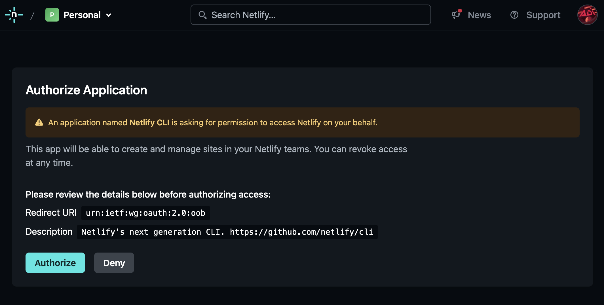
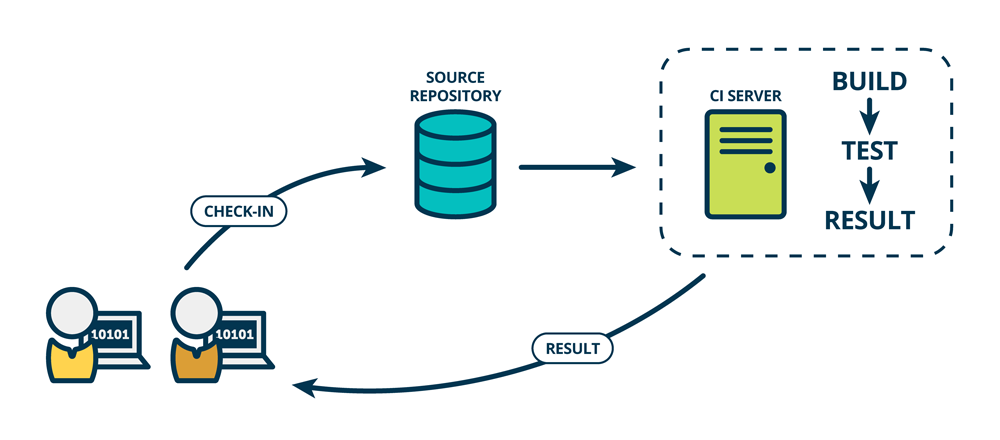

# Astro website template

Zaimportuj szalon do *Replit.com* ⬇

[](https://replit.com/new/github/ALOPB-Hack-Club/astro-website-template)

Stwórz nowe repozytorium *GitHub* z CI i prjektem *Netlify* ⬇

[](https://app.netlify.com/start/deploy?repository=https://github.com/alopb-hack-club/astro-website-template)

## 🚀 Struktura projektu

Szablon składa się z kilku ważnych katalogów, w których umieszczamy pliki.

```text
/
├── src/
│   ├── layouts/
│   │   └── Layout.astro
│   └── pages/
│       └── index.md
└── .gitignore
```

Plik `index.md` jest naszą stroną, napisaną w markdownie.

`Layout.astro` jest natomiast otoczką na stronę. Można ją podpiąć do strony w markdownie poprzez dodanie nastepującego fragmentu kodu na początku pliku `.md`:
```
---
layout: '../layouts/Layout.astro'
---
```

Dotatkowo jest kilka katalogów, w których nie umieszczamy kodu.
Są to:
- `.vscode` - pliki pomocnicze programu *Visual Studio Code*
- `node_modules` - pobrane moduły (zależności) projektu
- `dist` - pliki zbudowanej strony, które finalnie umieścimy na serwerze

Wszystkie statyczne zasoby takie jak obrazy czy zdjęcia powinny znaleść się w katalogu `public/`.

Oprócz tego znaczącym plikiem jest `.gitignore` - pliki o nazwach podanych w tym pliku nie podlegają wersjonowaniu.

I wreszcie `netlify.toml` oraz `.replit`, czyli pliki zawierające odpowienio ustawienia stawiania (deploymentu) strony oraz konfigurację projektu na stronie [replit](https://replit.com/~).

Astro zwraca uwagę na pliki `.astro` oraz `.md` znajdujące się w katalogu `src/pages/`. Każda strona w tym samym katalogu powinna mieć unikatową nazwę.

## 🏗️ Rozbudowane ścieżki stron

Aby zagnieździć (znestować) ścieżkę naszej strony np. `blog/pierwszy-wpis` należy utworzyć katalog. Dodatkowo tworząc plik `index.md` bądź `index.astro` możemy zdefiniować co znajdzie się na samej ścieżce `/blog/`.
```text
pages/
├── index.astro
└── blog/
    ├── index.md          <-- `blog/`    
    └── pierwszy-wpis.md  <-- `blog/pierwszy-wpis/`
```

## 📘 Krok po kroku

### ⚒️ Tworzenie strony
Włącz serwer deweloperski, umożliwiający podgląd strony podczas pisania kodu.
```shell
npm run dev
```
Po każdorazowym zapisie pliku, strona znajdująca się pod adresem `http://localhost:4321/` zostanie zaktualizowana.

Możesz teraz edytować pliki, eksperymentować i stworzyć jedyną w swoim rodzaju stronę internetową!

### 🌐 Publikacja
Gdy uznasz, że świat jest już gotowy na twoją piękną stronę, zainstaluj CLI (command line interface) *Netlify*.
```shell
npm install netlify-cli -g
```

Teraz możesz wywołać nowo dodane narzędzie za pomocą polecenia `netlify`.
Użycie komend `netlify` pozwoli Ci opublikować w prosty sposób swoją stronę. Wcześniej należy być zalogowanym w przeglądarce na konto *Netlify*, aby powiązać nasze konto z narzędziem konsolowym.
```shell
netlify deploy
```
#### 📡 Powiązanie narzędzia z kontem Netlify
W przypadku kiedy konto nie zostało jeszcze powiązane w przeglądarce powinno otworzyć się okno:



> **Note**
> Na platformie *Replit* strona **może nie otworzyć się sama**, dlatego należy wtedy wejść w link podany w terminalu.


#### 🚀 Wdrażanie (deployment)
Jeżeli wcześniej strona nie była publikowana, wyświetlony zostanie następujący komunikat.
```text
This folder isn't linked to a site yet
? What would you like to do? 
  Link this directory to an existing site 
❯ +  Create & configure a new site
```

Wybierając drugą opcję, domyślnie zaznaczoną, klawiszem *enter* możemy stworzyć wersję testową, która będzie już publiczna w internecie. Następnie, wybieramy zespół, w którym znajdzie się nasza aplikacja - zwykle będzie to zespół *Personal*. Potem możemy nadać własną nazwę strony, bądź zostawić pole puste aby otrzymać losowo wygenerowaną nazwę. Wchodząc w link *Website draft URL* możemy zobaczyć swoją stronę umieszczoną już na zewnętrznym serwerze.

Jeżeli chcesz, aby twoja strona była zapisana, ponownie wpisz komendę `netlify deploy` tym razem dodając do niej flagę `--prod`, która spowoduje, że strona zostanie przypisana do naszego konta.

```shell
netlify deploy --prod
```

Aby zobaczyć naszą stronę na naszym koncie, możemy szybko przejść tam za pomocą komendy
```shell
netlify open
```

Z poziomu panelu *Netlify* możesz zarządać swoimi stronami oraz zmieniać takie parametry jak finalny URL strony!


#### CI (continuous integration)

Aby zautomatyzować powyższy proces, należy połączyć repozytorium *GitHub* z projektem *Netlify*. Dzięki temu *Netlify* zrobi za Ciebie robotę za każdym razem kiedy wyślesz zmiany do podłączonego repozytorium.
*deploymentu*. 



Możesz się teraz cieszyć automatycznie aktualizującą się stroną internetowej, na której możesz umieścić co chcesz!

## 🧞 Komendy

Możesz wywołać wszystkie komendy w konsoli znajdując się w głównej ścieżce projektu:

| Command                   | Action                                                                   |
| :------------------------ | :----------------------------------------------------------------------- |
| `npm install`             | Instaluje zależności                                                     |
| `npm run dev`             | Włącza lokalny serwer deweloperski `localhost:4321`                      |
| `npm run build`           | Buduje finalną wersję strony do katalogu `./dist/`                       |
| `npm run preview`         | Włącza podgląd finalnej wersji strony (pliki znajdujące się w `./dist/`) |
| `npm run astro ...`       | Wykonuje polecenia frameworka Astro `astro add`, `astro check`           |
| `npm run astro -- --help` | Wyświetla pomoc dotyczącą Astro                                          |

## 👀 Dokumentacja

[Oficjalna dokumentacja Astro ➚](https://docs.astro.build)
